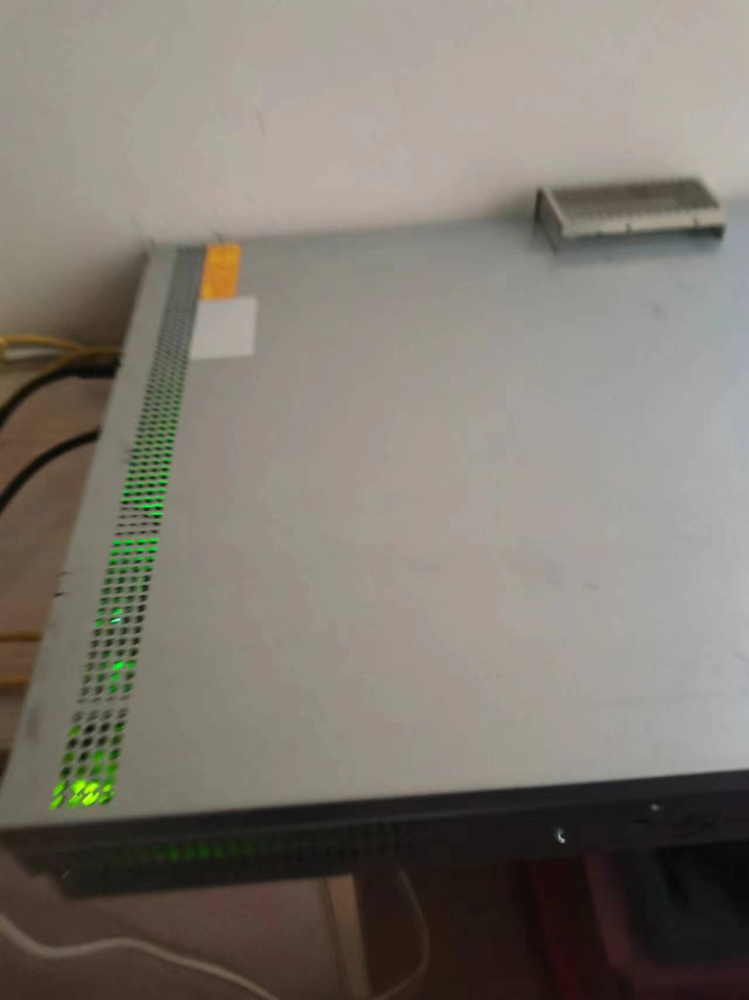

# 个人简历

iaalai

|本名|邓良浩|
|---|---|
|性别|男|
|名族|汉|
|籍贯|江西赣州|
|出生日期|2004-04|
|求职意向| 前端开发,服务器运维,后端开发 |
|期望城市| 任意 |
|联系邮箱|iaalai@iaalai.cn|
|联系电话| 18179722389 |

## 专业技能

掌握web开发的基本技术,熟练使用`html`、`css`完成对应的蓝湖设计原型.熟悉`javascript`,可以使用`ajax`完成动态页面

熟练使用前端`vue`相关的技术栈以及配套的`vuex`、`pinia`、`vite`和`webpack`等

会使用`uni-app`,开发过微信公众号平台和小程序.也尝试过使用`uni-app`打包安卓应用

对于`git`开发具备一定的了解,有过小型的项目协作经验(合作人数不超过5人)

对服务器比较感兴趣,部署过自己的服务器,从自己购买各种硬件到安装各种软件进行部署

## 个人优势

自学能力强,绝大部分知识都是源于自学.

一直参与开源社区(github),经常关注前端先进技术,对于钻研技术很感兴趣

有过一些简单的外包的经验,有过将蓝湖的设计稿开发为页面的经验,包括PC web,移动端,小程序

同时具备良好的沟通能力,接手外包的时候对接过不少对相关领域完全没有了解的,但是最后仍然艰苦的完成订单

对于前端很感兴趣,但是同时在校期间对于计算机领域的其他内容也稍有研究过

## 教育经历

### 江西环境工程职业学院 大专  软件技术   2022 - 2025

主修课程: java程序设计,网页设计与制作,mysql数据库 等

在校期间,我积极参与各种编程和技术竞赛,并取得了优异的成绩.这些比赛不仅提升了我的编程能力,还培养了我的团队合作和解决问题的能力.

同时大量系统性的学习了各种技能.从C++的数据结构与算法,再到java web开发的基本了解,都是我通过自学掌握的

这些丰富的学习经历不仅让我掌握了多种不同的技术,还培养了我的自学能力和解决问题的能力.我相信这些经历将使我在未来的工作中能够快速适应并做出贡献

在校期间参与过一些各种各样的比赛(省级以上):

- 2023年 蓝桥杯 C组 C/C++ 江西省一等奖
- 2023年 蓝桥杯 C组 C/C++ 全国优秀奖
- 2023年 金砖国家技能发展与技术创新大赛 移动跨平台开发 优秀奖
- 2023年 全国职业技能大赛 移动跨平台应用 开发三等奖
- 2023年 全国行业职业技能竞赛 智能硬件调装员 二等奖
- 2024年 蓝桥杯 C组 C/C++ 江西省一等奖
- 2024年 蓝桥杯 C组 C/C++ 全国二等奖

### 工业职业中等专业学院 中专 平面设计 2019 - 2022

对于学校的平面设计专业几乎没有什么了解

在校期间开始自学编程,从最开始的大学课程里的c语言再到培训班的前端课程

那个时候就已经开始接触一些很简单的外包,比如淘宝商品宣传页面什么的了

要是我这个时期去参加中专组的比赛,应该是可以大杀四方了
