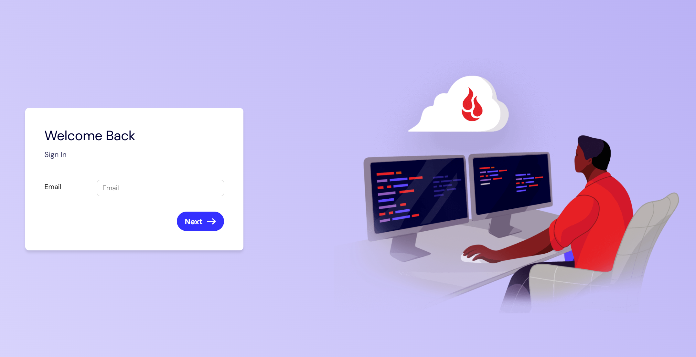
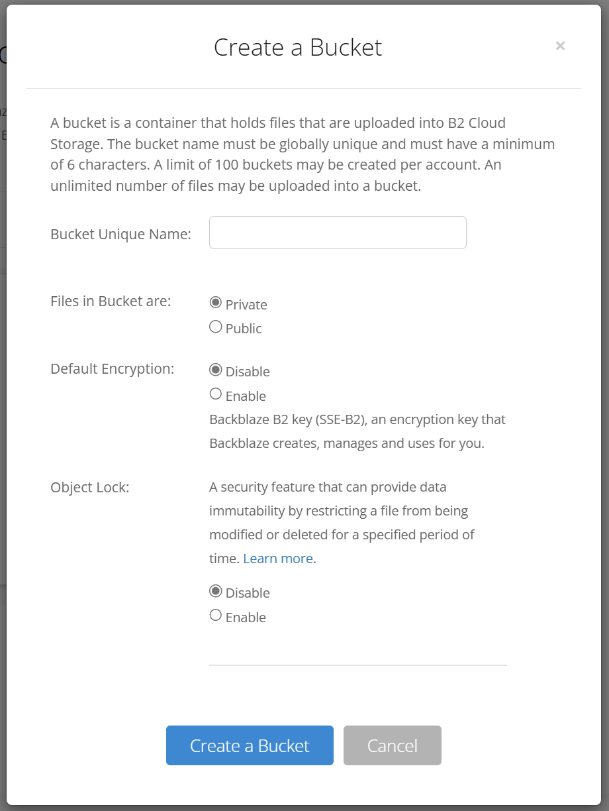

又看到一个可以薅的好东西了,10G免费的S3存储

Backblaze B2 可以提供免费的对象存储方案,同时和 Cloudflare具有合作,可以免收带宽费用

Blacklaze 免费额度(注意走 cloudflare 的时候不记录带宽费用)

| type | limit (d) |
| --- | --- |
| Usage | 10G |
| Class B | 2500 |
| Class C | 2500 |
| Bandwidth | 1G |

## 操作流程

第一步,先注册 Blacklaze 账户

第二步,创建一个存储桶,注意此时应该选择类型为允许公开访问

然后随意上传一个文件,在 `browser file` 中打开它,它的属性中有一个 Friendly URL ,这个 host 要记录下来,后续交给 CF 代理就是用这个 host

至此,Blacklaze相关步骤就已经成功了

之后就是,连接到 cloudflare 之中

cloudflare创建对应的域名解析

调整额外规则来隐藏一部分隐私信息:

1.
2.
3.

## 大功告成

B2 桶直接支持 S3 协议,后端可以无缝对接.也可以自己准备其他的管理后台.比如我是额外的连接到了 alist 之中

后续也可以此对象存储可以准备配套的图床之类的内容了,只不过此博客作为静态博客,图片资源都是放到文档之中的,没有额外的存储到图床之中

## 参考消息

知乎文章

B2 官方文档

- todo

<!-- 这次的图片导入失败让我感觉非常失望,是时候准备新的方案了.回头尝试迁移到 11ty 之中 -->
